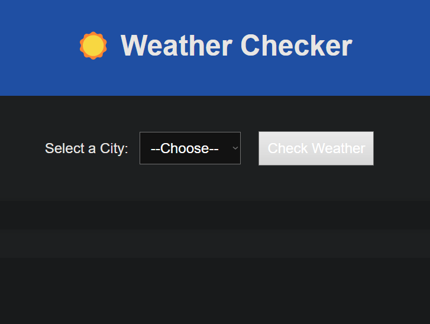
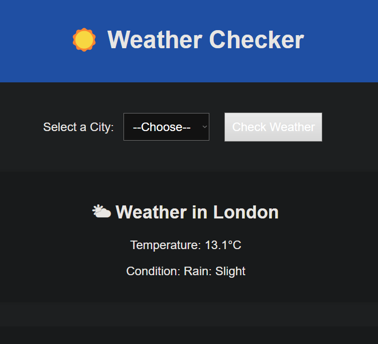
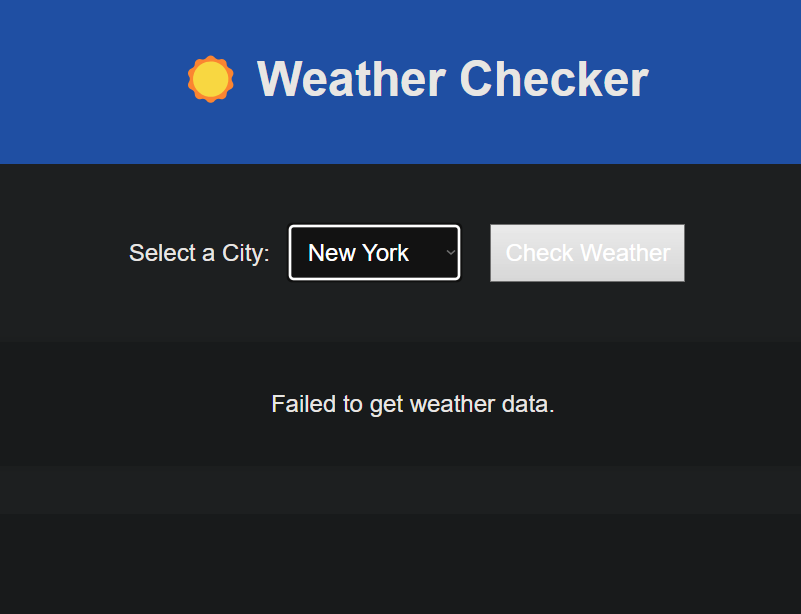
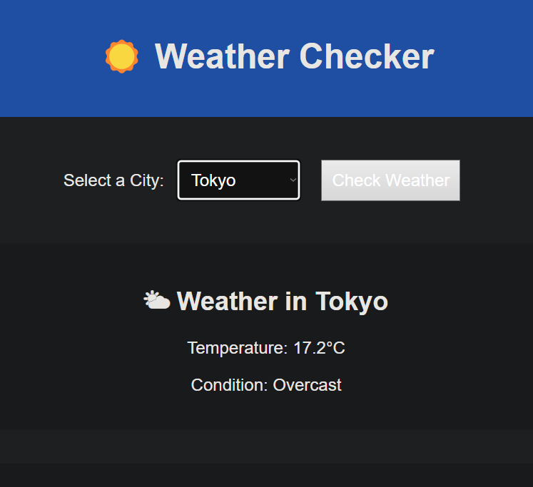
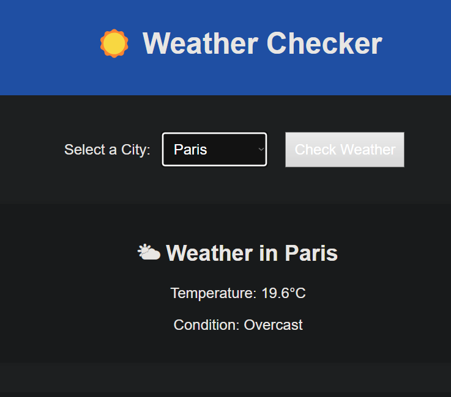
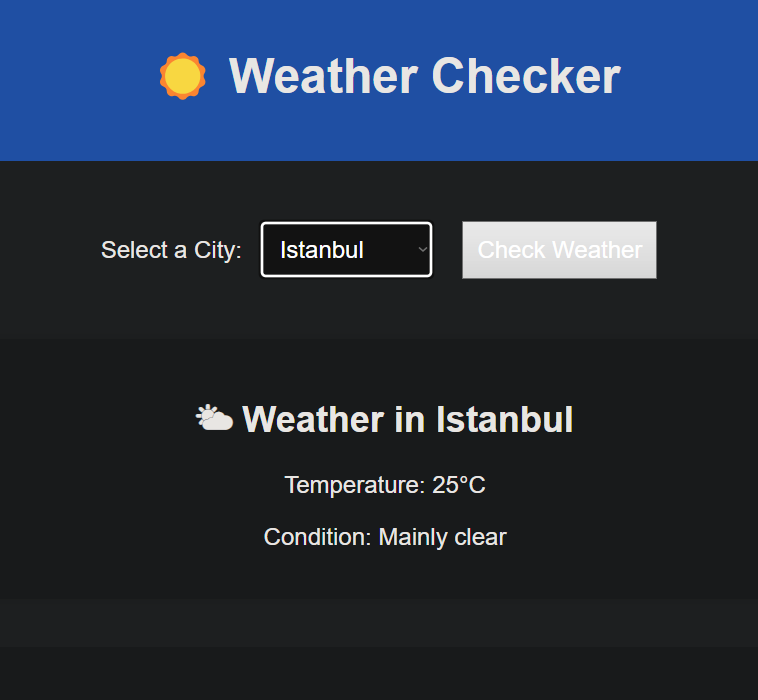

````markdown
# 🌤 Weather Checker App

A simple Node.js and Express web application that allows users to check real-time weather in major cities using the Open-Meteo API. Built with EJS templating and styled with CSS.

---

## 🚀 Features

- 🌆 Choose from major cities (London, New York, Tokyo, Paris, Istanbul)
- ☀️ Get real-time temperature and weather conditions
- 🌐 Uses Open-Meteo Geocoding & Weather APIs
- 🧠 Clean and minimal EJS-based frontend
- 📱 Responsive design

---

## 📂 Project Structure

weather-app/
│
├── views/
│ ├── index.ejs # Main page
│ └── partials/
│ ├── header.ejs # HTML head + header
│ └── footer.ejs # Footer
│
├── public/
│ └── styles/
│ └── main.css # Stylesheet
│ └── images/ # City images
│
├── index.js # Main server logic
├── package.json
└── README.md

---

## 🧪 How It Works

1. User selects a city from the dropdown form on the homepage.
2. The server sends a request to the Open-Meteo Geocoding API to get the city's coordinates.
3. The coordinates are then used to fetch the current weather via Open-Meteo's Forecast API.
4. The data is parsed and displayed on the same page.

---

## 🛠️ Technologies Used

- [Node.js](https://nodejs.org/)
- [Express.js](https://expressjs.com/)
- [EJS](https://ejs.co/)
- [Axios](https://axios-http.com/)
- [Open-Meteo API](https://open-meteo.com/)
- HTML5, CSS3

---

## 📦 Installation & Setup

1. **Clone the repository:**

   ```bash
   git clone https://github.com/yourusername/weather-app.git
   cd weather-app
   ```

2. **Install dependencies:**

   ```bash
   npm install
   ```

3. **Start the server:**

   ```bash
   nodemon index.js
   ```

4. **Open your browser:**

   ```
   http://localhost:3000
   ```

---

## 🧾 Example Weather Description Mapping

The app maps weather codes from Open-Meteo to descriptions like:

- 0: Clear sky
- 1: Mainly clear
- 2: Partly cloudy
- 3: Overcast
- 45: Fog
- 61: Rain (light)
- 75: Heavy snow

> Full list available in `index.js`.

---

## 🙋‍♂️ Author

Built by me as part of my learning journey in full-stack development.

---

## 📜 License

This project is open for personal, educational, and non-commercial use.

---

## 🖼️ Images













---
````
